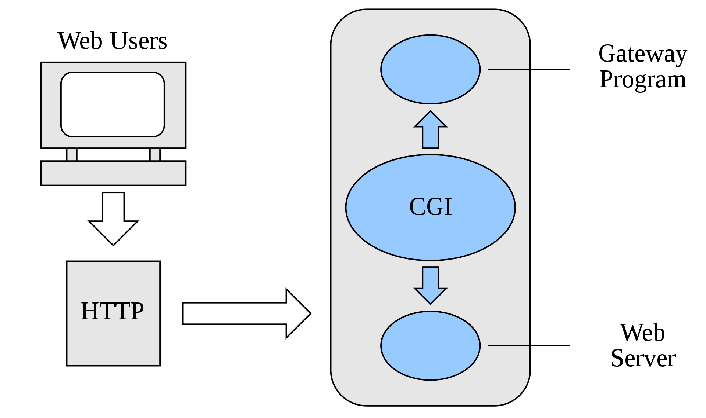
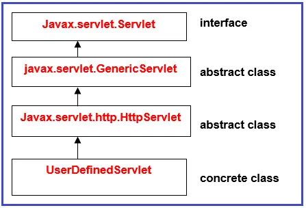

# mvc-framework
MVC 프레임워크를 간단하게 만들어보자

- [x] 계산기 기능 구현 
- [x] HTTP 요청/응답 기능 구현 `was-practice`
- [ ] 서블릿 인터페이스를 직접 구현

# 환경
- JDK 11
- [apache-tomcat-9.0.65.tar.gz](https://dlcdn.apache.org/tomcat/tomcat-9/v9.0.65/bin/apache-tomcat-9.0.65.tar.gz) 
  ```bash
  # 실행
  $TOMCAT_PATH/bin/startup.sh
  # 중지  
  $TOMCAT_PATH/bin/shutdown.sh
  ```

# HTTP 특징
- HTTP/1.1, HTTP/2는 TCP 기반 위에서 동작
- HTTP/3는 UDP 기반 위에서 동작

## HTTP 요청/응답 메시지 구조
- 클라이언트
  - 요청 메시지
    - Request line: `GET /calculate?operand1=11&operator=*&operand2=55 HTTP/1.1`
      - httpMethod: `GET`
      - path: `/calculate`
      - queryString: `operand1=10&operator=+&operand2=55`
    - Header
    - Blank line
    - Body
- 서버
  - 응답 메시지
    - Status line: `HTTP/1.1 200 OK`
    - Header
      - `Content-Type: application/json;charset=utf-8`
      - `Content-Length: 2`
    - Blank line
    - Body: `65`
## 클라이언트 - 서버 모델
- 무상태 프로토콜 (Stateless)
  - 서버가 클라이언트 상태를 유지하지 않음
  - 해결책 : Keep-Alive 속성 사용
- 비 연결성 (Connectionless)
  - 서버가 클라이언트 요청에 대해 응답을 마치면 맺었던 연결을 끊어버림
  - 해결책 : 쿠키 (클라이언트에 정보 저장), 세션 (서버에 정보 저장), JWT


# CGI (Common Gateway Interface)

[참조](https://ko.wikipedia.org/wiki/%EA%B3%B5%EC%9A%A9_%EA%B2%8C%EC%9D%B4%ED%8A%B8%EC%9B%A8%EC%9D%B4_%EC%9D%B8%ED%84%B0%ED%8E%98%EC%9D%B4%EC%8A%A4)

- 웹 서버와 애플리케이션 사이에 데이터를 주고받는 규약
- CGI 규칙에 따라서 만들어진 프로그램을 CGI 프로그램이라 함
- CGI 프로그램 종류
  - 컴파일 방식 (C, C++, Java 등)
  - 인터프리터 방식 (PHP, Python 등)

## 인터프리터 방식 CGI 프로그램
`웹 서버` ↔ `Script engine` ↔ `Script 파일`

## 서블릿과 서블릿 컨테이너
`웹 서버` ↔ `Servlet Container` ↔ `Servlet 파일`

### **Servlet (Server + Applet)**
- 자바에서 웹 애플리케이션을 만드는 기술
- 자바에서 동적인 웹 페이지를 구현하기 위한 표준

### **ServletContainer**
- **서블릿의 생성부터 소멸까지의 라이프사이클을 관리하는 역할**
- 서블릿 컨테이너는 웹 서버와 소켓을 만들고 통신하는 과정을 대신 처리해준다.
  - 컨테이너란 라이프사이클을 관리해준다는 의미와 비슷
  - 개발자는 비즈니스 로직에만 집중
- 서블릿 객체를 싱글톤으로 관리
  - **상태를 유지(stateful)하게 설계하면 안됨**
  - 상태를 유지하게 되면 Thread safety 하지 않음

## WAS vs ServletContainer


- WAS는 ServletContainer를 포함하는 개념
- WAS는 매 요청마다 Thread Pool에서 기존 Thread를 사용
- WAS의 주요 튜닝 포인트는 `max thread` 수
- 대표적인 WAS는 **`Tomcat`**

## Servlet Interface


- 서블릿 컨테이너가 서블릿 인터페이스에 있는 메소드들을 호출함
- 서블릿 생명주기와 관련된 메서드
  - `init()`: 서블릿 생성 후 초기화 작업을 수행
  - `service()`: 클라이언트 요청이 들어올 때 마다 서블릿 컨테이너가 호출하는 메서드
  - `destroy()`: 서블릿 컨테이너가 종료될 때 호출
- 서블릿 기타 메서드
  - `getServletConfig()`: 서블릿 초기 설정 정보를 담고있는 객체를 반환
  - `getServletInfo()`: 서블릿 정보를 반환