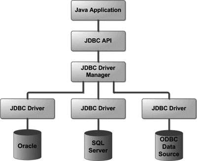

# mvc-framework
MVC 프레임워크를 간단하게 만들어보자

- [x] 계산기 기능 구현 
- [x] HTTP 요청/응답 기능 구현 `was-practice`
- [x] 서블릿 인터페이스를 직접 구현
- [x] JDBC template 구현

# 환경
- JDK 11
- [apache-tomcat-9.0.65.tar.gz](https://dlcdn.apache.org/tomcat/tomcat-9/v9.0.65/bin/apache-tomcat-9.0.65.tar.gz) 
  ```bash
  # 실행
  $TOMCAT_PATH/bin/startup.sh
  # 중지  
  $TOMCAT_PATH/bin/shutdown.sh
  ```

# HTTP 특징
- HTTP/1.1, HTTP/2는 TCP 기반 위에서 동작
- HTTP/3는 UDP 기반 위에서 동작

## HTTP 요청/응답 메시지 구조
- 클라이언트
  - 요청 메시지
    - Request line: `GET /calculate?operand1=11&operator=*&operand2=55 HTTP/1.1`
      - httpMethod: `GET`
      - path: `/calculate`
      - queryString: `operand1=10&operator=+&operand2=55`
    - Header
    - Blank line
    - Body
- 서버
  - 응답 메시지
    - Status line: `HTTP/1.1 200 OK`
    - Header
      - `Content-Type: application/json;charset=utf-8`
      - `Content-Length: 2`
    - Blank line
    - Body: `65`
## 클라이언트 - 서버 모델
- 무상태 프로토콜 (Stateless)
  - 서버가 클라이언트 상태를 유지하지 않음
  - 해결책 : Keep-Alive 속성 사용
- 비 연결성 (Connectionless)
  - 서버가 클라이언트 요청에 대해 응답을 마치면 맺었던 연결을 끊어버림
  - 해결책 : 쿠키 (클라이언트에 정보 저장), 세션 (서버에 정보 저장), JWT


# CGI (Common Gateway Interface)

[참조](https://ko.wikipedia.org/wiki/%EA%B3%B5%EC%9A%A9_%EA%B2%8C%EC%9D%B4%ED%8A%B8%EC%9B%A8%EC%9D%B4_%EC%9D%B8%ED%84%B0%ED%8E%98%EC%9D%B4%EC%8A%A4)

- 웹 서버와 애플리케이션 사이에 데이터를 주고받는 규약
- CGI 규칙에 따라서 만들어진 프로그램을 CGI 프로그램이라 함
- CGI 프로그램 종류
  - 컴파일 방식 (C, C++, Java 등)
  - 인터프리터 방식 (PHP, Python 등)

## 인터프리터 방식 CGI 프로그램
`웹 서버` ↔ `Script engine` ↔ `Script 파일`

## 서블릿과 서블릿 컨테이너
`웹 서버` ↔ `Servlet Container` ↔ `Servlet 파일`

### **Servlet (Server + Applet)**
- 자바에서 웹 애플리케이션을 만드는 기술
- 자바에서 동적인 웹 페이지를 구현하기 위한 표준

### **ServletContainer**
- **서블릿의 생성부터 소멸까지의 라이프사이클을 관리하는 역할**
- 서블릿 컨테이너는 웹 서버와 소켓을 만들고 통신하는 과정을 대신 처리해준다.
  - 컨테이너란 라이프사이클을 관리해준다는 의미와 비슷
  - 개발자는 비즈니스 로직에만 집중
- 서블릿 객체를 싱글톤으로 관리
  - **상태를 유지(stateful)하게 설계하면 안됨**
  - 상태를 유지하게 되면 Thread safety 하지 않음

## WAS vs ServletContainer


- WAS는 ServletContainer를 포함하는 개념
- WAS는 매 요청마다 Thread Pool에서 기존 Thread를 사용
- WAS의 주요 튜닝 포인트는 `max thread` 수
- 대표적인 WAS는 **`Tomcat`**

## Servlet Interface


- 서블릿 컨테이너가 서블릿 인터페이스에 있는 메소드들을 호출함
- 서블릿 생명주기와 관련된 메서드
  - `init()`: 서블릿 생성 후 초기화 작업을 수행
  - `service()`: 클라이언트 요청이 들어올 때 마다 서블릿 컨테이너가 호출하는 메서드
  - `destroy()`: 서블릿 컨테이너가 종료될 때 호출
- 서블릿 기타 메서드
  - `getServletConfig()`: 서블릿 초기 설정 정보를 담고있는 객체를 반환
  - `getServletInfo()`: 서블릿 정보를 반환


## GenericServlet
- 인터페이스가 아닌 아닌 추상 클래스
- `service()`만 구현하면 됨
  - `init()`, `destroy()`, `getServletConfig()`, `getServletInfo()`은 필요한 경우에만 구현

## HttpServlet
- GeneriServlet과 다르게 Http 메서드마다 다르게 동작할 수 있도록 메서드를 지원한다.
- `service()` 메서드 내에서 Http 메서드 요청에 따라 아래 메서드들을 호출한다.
  - `doGet()`
  - `doPost()`
  - `doPut()`
  - `doHead()`
  - `doDelete()`
- 따라서 오버라이드가 필요

> URL 인코딩 (= 퍼센트 인코딩) <br>
> - URL로 사용할 수 없는 문자(예약어, Non-ASCII 문자(한글) 등)를 사용할 수 있도록 인코딩
> - 인코딩 된 문자는 triplet(세 개가 한 세트)로 인코딩 되며 각각을 % 다음에 두 개의 16진수로 표현


# JDBC (Java Database Connectivity)
- 자바 애플리케이션에서 DB 프로그래밍을 할 수 있도록 도와주는 표준 인터페이스
- JDBC 인터페이스들을 구현한 구현체들은 각 데이터베이스 벤더 사들이 제공함
  - 드라이버라고 부른다.



## DBCP (Database Connection Pool)
- 미리 일정량의 DB 커넥션을 생성해서 풀에 저장해두고 있다가 요청에 따라 필요할 때 풀에서 커넥션을 가져다가 사용하는 기법
- Spring Boot 2.0 부터는 Default 커넥션 풀로 HikariCP 사용

### 커넥션 풀 사용 시 유의사항
- 커넥션의 사용 주체는 WAS Thread이므로 커넥션 개수는 WAS Thread 수와 함께 고려해야 함
- 커넥션 수를 크게 설정하면 메모리 소모가 큰 대신 동시 접속자 수가 많아지더라도 사용자 대기 시간이 상대적으로 줄어들게 되고, 반대로 커넥션 개수를 작세 설정하면 메모리 소모는 적은 대신 그만큼 대기 시간이 길어질 수 있다.
  - 따라서 적정량의 커넥션 객체를 생성해 두어야 한다.

## DataSource
- 커넥션을 획득하기 위한 표준 인터페이스
- ex) HikariCP DataSource


# Reflection
- Heap 영역에 로드돼 있는 클래스 타입의 객체를 통해 필드/메서드/생성자를 접근 제어자와 상관 없이 사용할 수 있도록 지원하는 API
  - Heap 영역에 있는 클래스를 불러오는 3가지 방법
    ```java
    // 1
    Class<User> clazz = User.class;

    // 2
    User user = new User("noose", "홍길동");
    Class<? extends User> clazz2 = user.getClass();

    // 3
    Class<?> clazz3 = Class.forName("org.example.model.User");
    
    assertThat(clazz == clazz2).isTrue();
    assertThat(clazz2 == clazz3).isTrue();
    assertThat(clazz3 == clazz).isTrue();
    ```

- 컴파일 시점이 아닌 런타임 시점에 동적으로 특정 클래스의 정보를 추출해낼 수 있는 프로그래밍 기법
- 주로 프레임워크 또는 라이브러리 개발 시 사용됨
  - Spring 프레임워크 (ex. DI)
  - Test 프레임워크 (ex. JUnit)
  - JSON Serializaiton/Deserialization 라이브러리 (ex. Jackson)
  - 등등


# Front Controller Pattern
  - 모든 요청을 단일 handler(처리기)에서 처리하도록 하는 패턴
  - 스프링 웹 MVC 프레임워크의 DispathcerServlet(Front Controller 역할)이 Front Controller 패턴으로 구현돼 있음

  
## Forward vs Redirect

### Forward
- 서블릿에서 클라이언트(웹 브라우저)를 거치지 않고 바로 다른 서블릿(또는 JSP)에게 요청하는 방식
- Forward 방식은 서버 내부에서 일어나는 요청이기 때문에 `HttpServletRequest`, `HttpServletResponse` 객체가 새롭게 생성되지 않음(공유 됨)
  ```java
  RequestDispatcher dispatcher = request.getRequestDispatcher("포워드 할 서블릿 또는 JSP");
  dispatcher.forward(request, response);
  ```
### Redirect
- 서블릿이 클라이언트(웹 브라우저)를 다시 거쳐 다른 서블릿(JSP)에게 요청하는 방식
- Redirect 방식은 클라이언트로부터 새로운 요청이기 때문에 새로운 `HttpServletRequest`, `HttpServletResponse` 객체가 생성됨
- `HttpServletResponse` 객체의 `sendRedirect()` 이용

## DispathcerServlet
